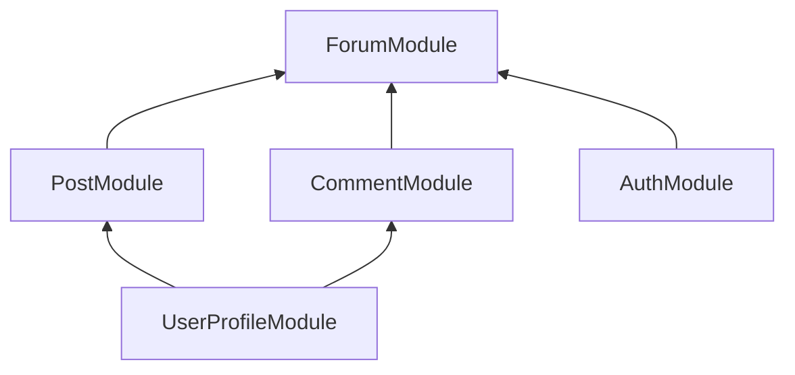
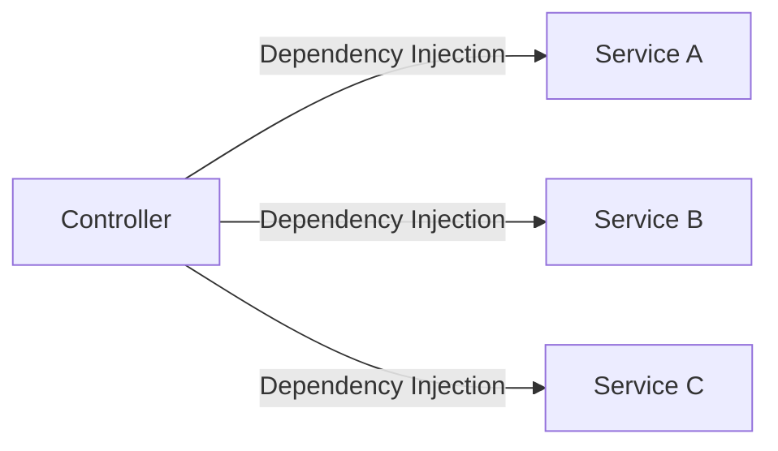
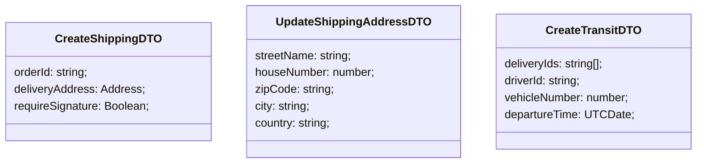

## NestJS Modules

Each application has at least one module - the root module. That is the starting point of the application.

Modules are an effective way to organize components by a closely related set of capabilities (e.g. per feature).

It is a good practice to have a folder per module, containing the module's components.

Modules are **singletons**, therefore a module can be imported by multiple other modules.

## Defining a Module

A module is defined by annotating a class with the `@Module` decorator.

The decorator provides metadata that Nest uses to organize the application structure.

## @Module Decorator Properties

- **providers**: array of providers to be available within the module via dependency injection.
- **controllers**: array of controllers to be instantiated within the module.
- **exports**: array of providers to export to other modules.
- **imports**: list of modules required by this module. Any exported provider by these modules will now be available in our module via dependency injection.

## Example



```ts
@Module({
  providers: [ForumService],
  controllers: [FormController],
  imports: [PostModule, CommentModule, AuthModule],
  exports: [ForumService],
})
export class ForumModule {}
```

## NestJS Controllers

Responsible for handling incoming requesta and returning responses to the client.

Bound to a specific path (for example `/tasks` for the task resource).

Contain handlers, which handle endpoints and request methods (`GET`, `PUT`, `POST`, `DELETE`, etc).

Can take advantage of dependency injection to consume providers within the same module.

## Defining a Controller

Controllers are defined by decorating a class with the `@Controller` decorator.

The decorator accepts a string, which is the path to be handled by the controller.

```ts
@Controller('/tasks')
export class TaskController {}
```

## Defining a hanlder

Handlers are simply methods within the controller class, decorated with decorators such as `@Get`, `@Post`, `@Delete`, etc.

```ts
@Controller('/tasks')
export class TaskController {
  @Get()
  getAllTasks() {
    return;
  }

  @Post()
  createTask() {
    return;
  }
}
```

## NestJS Providers

Can be injected into constructors if decorated as an `@Injectable`, via dependency injection.

Can be a plain value, a class, a sync/async factory, etc.

Providers must be provided to a module for them to be usable.

Can be exported from a module - and then be available to other modules that import it.

## Services

Defined as a provider. **Not all providers are services**.

Common concept within software development.

Singleton when wrapped within `@Injectable` and provided to a module. That means, the same instance will be shared across the application - acting as a single source of truth.

The main source of business logic. For example, a service will be called from a controller to validate data, create an item in the database and return a response.



```ts
import { TasksController } from './tasks.controller';
import { TasksService } from './tasks.service';
import { LoggerService } from '../shared/logger.service';

@Module({
  controllers: [TasksController],
  providers: [TasksService, LoggerService],
})
export class TasksModule {}
```

## Dependency Injection in NestJS

Any component within the NestJS ecosystem can inject a provider that is decorated with the `@Injectable`.

We define the dependencies in the constructor of the class. NestJS will take care of the injection for us, and it will then be available as a class property.

```ts
import { TasksService } from './tasks.service';

@Controller('/tasks')
export class TasksController {
  constructor(private tasksService: TasksService) {}

  @Get()
  async getAllTasks() {
    return await this.tasksService.getAllTasks();
  }
}
```

## Data Transfer Object (DTO)

An object that carries data between processes.

An object that is used to encapsulate data, and send it from one subsystem of an application to another.

An object that defines how the data will be sent over the network.

It can be used as a TypeScript type resulting in more bulletproof code.

It does **NOT** have any behavior except for storage, retrieval, serialization and deserialization of its own data.

It results in increased performance (although negligible in small applications).

Can be useful for data validation.

A DTO is **NOT** a model definition. It defines the shape of data for a specific case (operation), for example creating a task.

Can be defined using an interface or a class.

## Classes vs Interfaces for DTOs

DTOs can be defined as classes or interfaces.

The recommended approach is to use **classes**, also clearly documented in the NestJS documentation.

The reason is that interfaces are part of TypeScript and therefore are not preserved post-compilation.

Classes allow us to do more, and since they are a part of JavaScript, they will be preserved post-compilation.

NestJS cannot refer to interfaces in run-time, but can refer to classes.

**Classes are the way to go for DTOs**



DTOs are **NOT** mandatory.

You can still develop applications without using DTOs.

However, the value they add makes it worthwhile to use them when applicable.

Applying the DTO pattern as soon as possible will make it easy for you to maintain and refactor your code.

## PATCH Best Practices

- Refer to the resource in the URL.
- Refer to a specific item by ID.
- Specify what has to be patched in the URL.
- Provide the required parameters in the request body.
- `PATCH http://localhost:3000/tasks/be8b4cc2-7732-45e5-81a0-1b5c738484d2/status`

## NestJS Pipes

Pipes operate on the **arguments** to be processed by the route handler, just before the handler is called.

Pipes can perform **data transformation** or **data validation**.

Pipes can return data (either original or modified) which will be passed on to the route handler.

Pipes can throw exceptions. Exceptions thrown will be handled by NestJS and parsed into an error response.

Pipes can be asynchronous.

## Default pipes in NestJS

NestJS ships with useful pipes within the `@nestjs/common` module.

### ValidationPipe

Validates the compatibility of an entire object against a class (goes well with DTOs). If any property cannot be mapped correctly (for example, mismatching type) validation will fail.

### ParseInt Pipe

By default, arguments are of type `String`. This pipe validates that an argument is a number. If successful, the argument is transformed into a **Number** and passed on to the handler.

## Custom Pipe Implementation

Pipes are classes annotated with the `@Injectable` decorator.

Pipes must implement the `PipeTransform` generic interface. Therefore, every pipe must have a `transform()` method. This method will be called by NestJS to process the arguments.

The `transform()` method accepts two parameters:

- **value** the value of the processed argument.
- **metadata** (optional) an object containing metadata about the argument.

Whatever is returned from the `transform()` method will be passed on to the route handler. Exceptions will be sent back to the client.

Pipes can be consumed in different ways.

**Handler-level pipes** are defined at the handler level, via the `@UsePipes()` decorator. Such pipe will process all parameters for the incoming requests.

```ts
@Post()
@UsePipes(SomePipe)
createTask(@Body('description') description:string) {}
```

**Global pipes** are defined at the application level and will be applied to any incoming request.

```ts
async function bootstrap() {
  const app = await NestFactory.create(ApplicationModule);
  app.useGlobalPipes(SomePipe);
  await app.listen(3000);
}
bootstrap();
```

## Parameter-level vs Handler-level pipes. Which one?

**It depends**.

**Parameter-level pipes** tend to be slimmer and cleaner. However, they often result in extra code added to handlers, this can get messy and hard to maintain.

**Handler-level pipes** require some more code, but provide some great benefits:

- Such pipes do not require extra code at the parameter level.
- Easier to maintain and expand. If the shape of the data changes, it is easy to make the necessary changes within the pipe only.
- Responsibility of identifying the arguments to process is shifted to one central file (the pipe file).
- Promote usage of DTOs which is a very good practice.

Extensive [list](https://github.com/typestack/class-validator#validation-decorators) of validation decorators available in `class-validator`.
