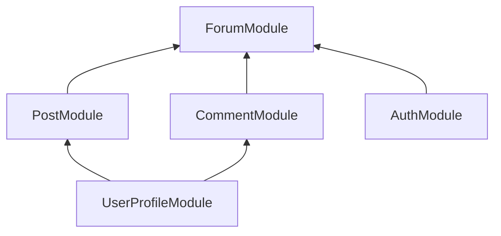
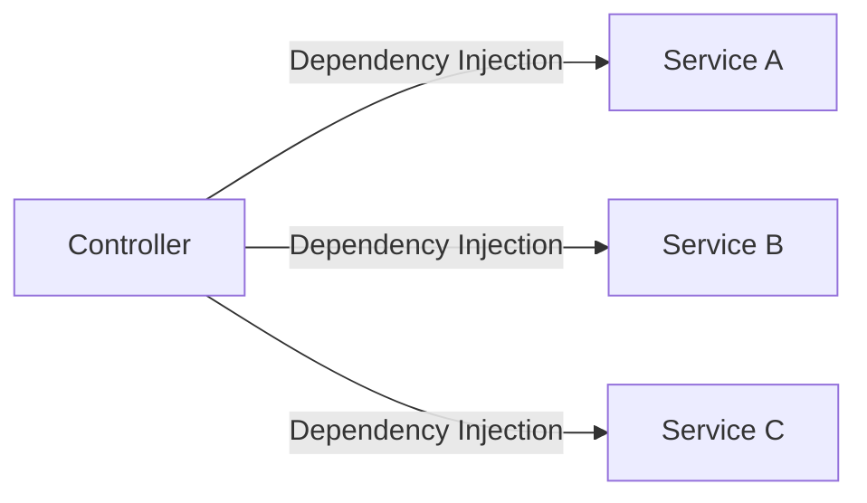
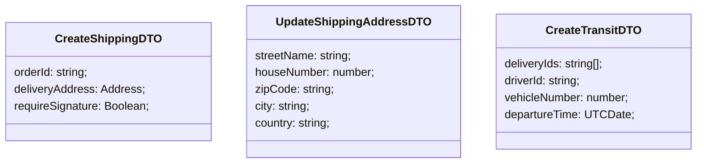

<p align="center">
  <a href="http://nestjs.com/" target="blank"></a>
</p>

[circleci-image]: https://img.shields.io/circleci/build/github/nestjs/nest/master?token=abc123def456
[circleci-url]: https://circleci.com/gh/nestjs/nest

  <p align="center">A progressive <a href="http://nodejs.org" target="_blank">Node.js</a> framework for building efficient and scalable server-side applications.</p>
    <p align="center">
<a href="https://www.npmjs.com/~nestjscore" target="_blank"></a>
<a href="https://www.npmjs.com/~nestjscore" target="_blank"></a>
<a href="https://www.npmjs.com/~nestjscore" target="_blank"></a>
<a href="https://circleci.com/gh/nestjs/nest" target="_blank"></a>
<a href="https://discord.gg/G7Qnnhy" target="_blank"></a>
<a href="https://opencollective.com/nest#backer" target="_blank"></a>
<a href="https://opencollective.com/nest#sponsor" target="_blank"></a>
  <a href="https://paypal.me/kamilmysliwiec" target="_blank"></a>
    <a href="https://opencollective.com/nest#sponsor"  target="_blank"></a>
  <a href="https://twitter.com/nestframework" target="_blank"></a>
</p>
  <!--[](https://opencollective.com/nest#backer)
  [](https://opencollective.com/nest#sponsor)-->

## Description

[Nest](https://github.com/nestjs/nest) framework TypeScript starter repository.

## Project setup

```bash
$ npm install
```

## Compile and run the project

```bash
# development
$ npm run start

# watch mode
$ npm run start:dev

# production mode
$ npm run start:prod
```

## Run tests

```bash
# unit tests
$ npm run test

# e2e tests
$ npm run test:e2e

# test coverage
$ npm run test:cov
```

## Deployment

When you're ready to deploy your NestJS application to production, there are some key steps you can take to ensure it runs as efficiently as possible. Check out the [deployment documentation](https://docs.nestjs.com/deployment) for more information.

If you are looking for a cloud-based platform to deploy your NestJS application, check out [Mau](https://mau.nestjs.com), our official platform for deploying NestJS applications on AWS. Mau makes deployment straightforward and fast, requiring just a few simple steps:

```bash
$ npm install -g @nestjs/mau
$ mau deploy
```

With Mau, you can deploy your application in just a few clicks, allowing you to focus on building features rather than managing infrastructure.

## Resources

Check out a few resources that may come in handy when working with NestJS:

- Visit the [NestJS Documentation](https://docs.nestjs.com) to learn more about the framework.
- For questions and support, please visit our [Discord channel](https://discord.gg/G7Qnnhy).
- To dive deeper and get more hands-on experience, check out our official video [courses](https://courses.nestjs.com/).
- Deploy your application to AWS with the help of [NestJS Mau](https://mau.nestjs.com) in just a few clicks.
- Visualize your application graph and interact with the NestJS application in real-time using [NestJS Devtools](https://devtools.nestjs.com).
- Need help with your project (part-time to full-time)? Check out our official [enterprise support](https://enterprise.nestjs.com).
- To stay in the loop and get updates, follow us on [X](https://x.com/nestframework) and [LinkedIn](https://linkedin.com/company/nestjs).
- Looking for a job, or have a job to offer? Check out our official [Jobs board](https://jobs.nestjs.com).

## Support

Nest is an MIT-licensed open source project. It can grow thanks to the sponsors and support by the amazing backers. If you'd like to join them, please [read more here](https://docs.nestjs.com/support).

## Stay in touch

- Author - [Kamil Myśliwiec](https://twitter.com/kammysliwiec)
- Website - [https://nestjs.com](https://nestjs.com/)
- Twitter - [@nestframework](https://twitter.com/nestframework)

## License

Nest is [MIT licensed](https://github.com/nestjs/nest/blob/master/LICENSE).

## NestJS Modules

Each application has at least one module - the root module. That is the starting point of the application.

Modules are an effective way to organize components by a closely related set of capabilities (e.g. per feature).

It is a good practice to have a folder per module, containing the module's components.

Modules are **singletons**, therefore a module can be imported by multiple other modules.

## Defining a Module

A module is defined by annotating a class with the `@Module` decorator.

The decorator provides metadata that Nest uses to organize the application structure.

## @Module Decorator Properties

- **providers**: array of providers to be available within the module via dependency injection.
- **controllers**: array of controllers to be instantiated within the module.
- **exports**: array of providers to export to other modules.
- **imports**: list of modules required by this module. Any exported provider by these modules will now be available in our module via dependency injection.

## Example



```ts
@Module({
  providers: [ForumService],
  controllers: [FormController],
  imports: [PostModule, CommentModule, AuthModule],
  exports: [ForumService],
})
export class ForumModule {}
```

## NestJS Controllers

Responsible for handling incoming requesta and returning responses to the client.

Bound to a specific path (for example `/tasks` for the task resource).

Contain handlers, which handle endpoints and request methods (`GET`, `PUT`, `POST`, `DELETE`, etc).

Can take advantage of dependency injection to consume providers within the same module.

## Defining a Controller

Controllers are defined by decorating a class with the `@Controller` decorator.

The decorator accepts a string, which is the path to be handled by the controller.

```ts
@Controller('/tasks')
export class TaskController {}
```

## Defining a hanlder

Handlers are simply methods within the controller class, decorated with decorators such as `@Get`, `@Post`, `@Delete`, etc.

```ts
@Controller('/tasks')
export class TaskController {
  @Get()
  getAllTasks() {
    return;
  }

  @Post()
  createTask() {
    return;
  }
}
```

## NestJS Providers

Can be injected into constructors if decorated as an `@Injectable`, via dependency injection.

Can be a plain value, a class, a sync/async factory, etc.

Providers must be provided to a module for them to be usable.

Can be exported from a module - and then be available to other modules that import it.

## Services

Defined as a provider. **Not all providers are services**.

Common concept within software development.

Singleton when wrapped within `@Injectable` and provided to a module. That means, the same instance will be shared across the application - acting as a single source of truth.

The main source of business logic. For example, a service will be called from a controller to validate data, create an item in the database and return a response.



```ts
import { TasksController } from './tasks.controller';
import { TasksService } from './tasks.service';
import { LoggerService } from '../shared/logger.service';

@Module({
  controllers: [TasksController],
  providers: [TasksService, LoggerService],
})
export class TasksModule {}
```

## Dependency Injection in NestJS

Any component within the NestJS ecosystem can inject a provider that is decorated with the `@Injectable`.

We define the dependencies in the constructor of the class. NestJS will take care of the injection for us, and it will then be available as a class property.

```ts
import { TasksService } from './tasks.service';

@Controller('/tasks')
export class TasksController {
  constructor(private tasksService: TasksService) {}

  @Get()
  async getAllTasks() {
    return await this.tasksService.getAllTasks();
  }
}
```

## Data Transfer Object (DTO)

An object that carries data between processes.

An object that is used to encapsulate data, and send it from one subsystem of an application to another.

An object that defines how the data will be sent over the network.

It can be used as a TypeScript type resulting in more bulletproof code.

It does **NOT** have any behavior except for storage, retrieval, serialization and deserialization of its own data.

It results in increased performance (although negligible in small applications).

Can be useful for data validation.

A DTO is **NOT** a model definition. It defines the shape of data for a specific case (operation), for example creating a task.

Can be defined using an interface or a class.

## Classes vs Interfaces for DTOs

DTOs can be defined as classes or interfaces.

The recommended approach is to use **classes**, also clearly documented in the NestJS documentation.

The reason is that interfaces are part of TypeScript and therefore are not preserved post-compilation.

Classes allow us to do more, and since they are a part of JavaScript, they will be preserved post-compilation.

NestJS cannot refer to interfaces in run-time, but can refer to classes.

**Classes are the way to go for DTOs**



DTOs are **NOT** mandatory.

You can still develop applications without using DTOs.

However, the value they add makes it worthwhile to use them when applicable.

Applying the DTO pattern as soon as possible will make it easy for you to maintain and refactor your code.

## PATCH Best Practices

- Refer to the resource in the URL.
- Refer to a specific item by ID.
- Specify what has to be patched in the URL.
- Provide the required parameters in the request body.
- `PATCH http://localhost:3000/tasks/be8b4cc2-7732-45e5-81a0-1b5c738484d2/status`
